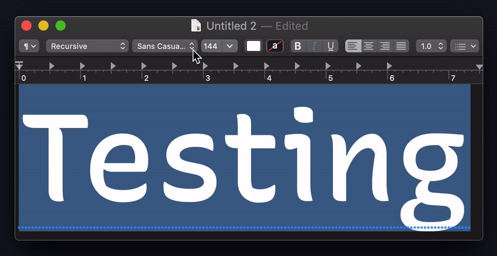
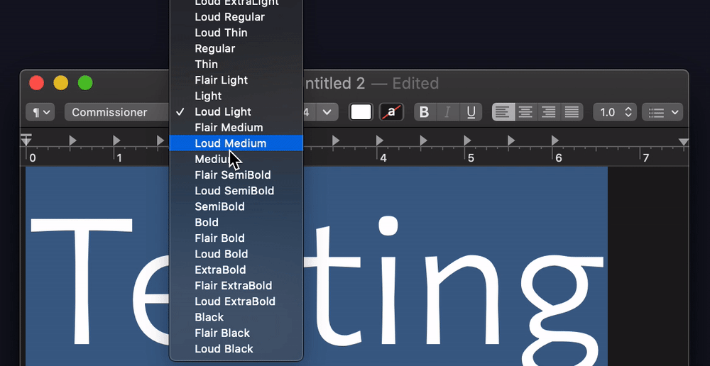
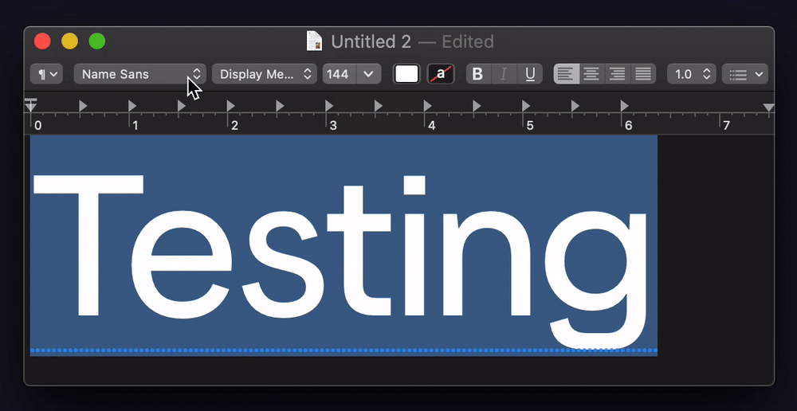
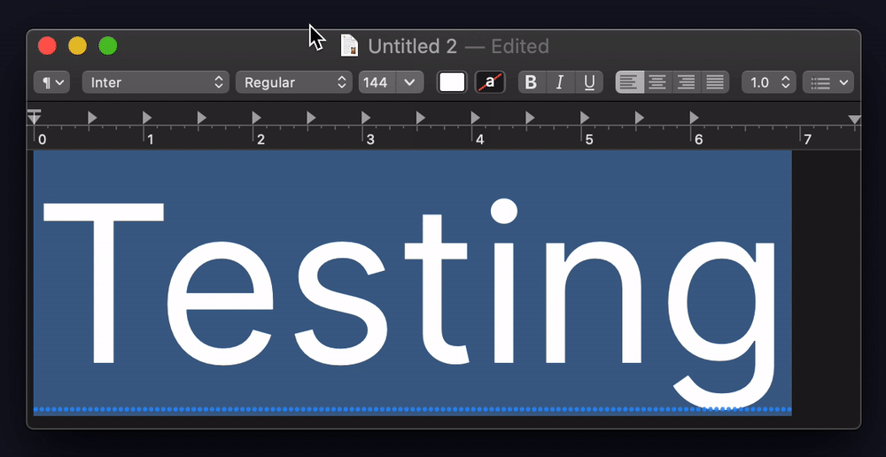
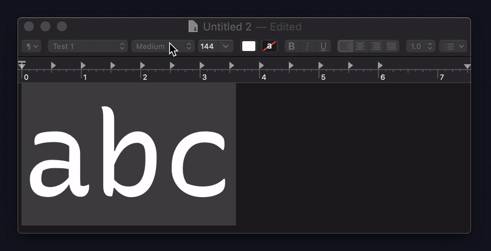
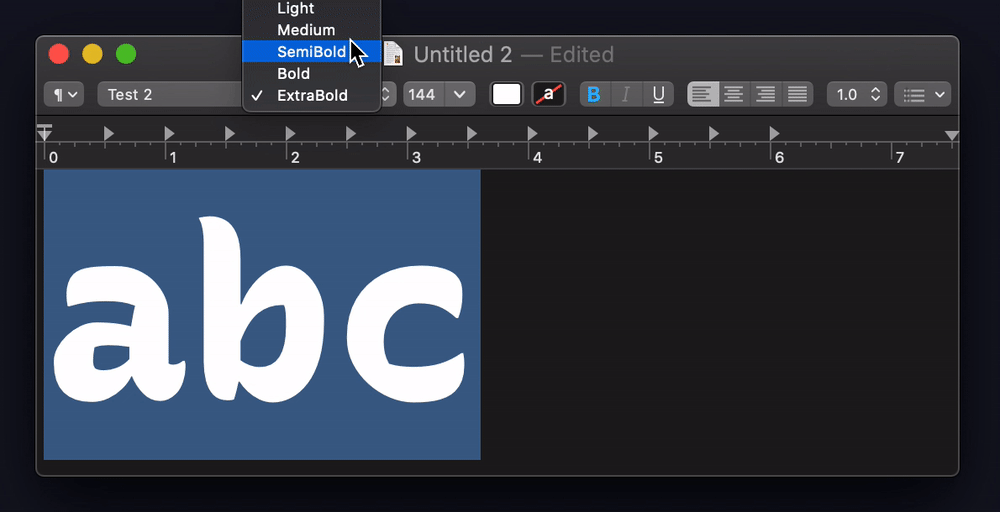

# Default Instance Test

On macOS Catalina (10.15.5 and earlier), there is an issue in which the default instance of a variable font cannot be selected in apps which use macOS system font handling (such as TextEdit, Keynote, Sketch, and more). This issue is not present in fonts with a default instance of “Regular,” but exists for all others. This repo is a way to investigate & provide a simple test case for this issue.

Useful Links:

- Apple Feedback [FB7734904](https://feedbackassistant.apple.com/feedback/7734904) (only works for Apple employees, as far as I know)
- Discussion in FontTools issues: https://github.com/fonttools/fonttools/issues/1994


## The Problem

### Technical summary

Variable fonts are composed of two or more *sources* (AKA “masters”) which allow intermediate styles to be derived via on-the-fly interpolation of coordinate points. They also usually have several to many *named instances* which are instances predefined by the font designer as useful locations within the designspace (available stylistic possibilities) of the font.

A simple example would be a font with sources at Light and ExtraBold weights, yielding a weight range of 300–800, and instances at Light, Regular, Medium, SemiBold, Bold, and ExtraBold.

A non-variable, “static” font records letter outlines as a series of mathematical curves with control points on a coordinate grid, in what is called the `glyf` table. A variable font also records points in the `glyf` table for the *default instance* – which is the style which will render even in older software that can’t display variable fonts. And then, a variable font also has tables recording the *deltas* of points, or the direction and amount they move by to render other sources. Intermediate instances are derived based on the default instance plus a factor of the deltas.

So, in the case of the two-source, Light to ExtraBold variable font, the default instance *must* be either Light or ExtraBold. Some (but not all) fonts will add an extra source at Regular, to have better control over the design, and so that the Regular style can be rendered in legacy software. However, this is not and should not be a requirement of a variable font, as each additional source adds filesize, and a primary benefit of the variable font format is reduction in filesize for the web.

Unfortunately, it seems that in system font handling macOS, only variable fonts with a default instance of “Regular” allow their default instance to be selected. If a default instance is anything else (e.g. Light), it cannot be selected from the font style menu.

### Examples

**Example:** [Recursive](https://github.com/arrowtype/recursive) has a default instance of `Sans Linear Light`. However, attempting to select this style instead results in selection of `Sans Casual Medium`.



**Example:** [Commissioner](https://github.com/kosbarts/Commissioner/blob/df81f836a18b8dca0e553e8fc55fe19de4935839/fonts/variable/Commissioner%5BFLAR%2CVOLM%2Cslnt%2Cwght%5D.ttf) has a default instance of `Thin`. Attempting to select this results in a selection of `Flair Medium`.



**Example:** [Name Sans](https://www.futurefonts.xyz/arrowtype/name-sans) (not open source, but does have a free trial font which can be tested) has a default instance of `Display Bold`. Attempting to select this style results in `Display Medium`.



**Example of working font w/ Regular instance:** [Inter](https://github.com/rsms/inter) does work, likely due to the default instance being “Regular.”



## Test files in this repo

The tests in this repo reproduce this issue with variable fonts which are as simple as possible – containing a minimum of sources, and only characters `a b c`. They are simplified versions of Recursive Mono.

Testing note: these fonts do not show up in the basic font menu of TextEdit, due to their limited character set. To select them, first install them, then open TextEdit, use the font menu, select `Show Fonts... → All Fonts` and then select `Test 1` or `Test 2`. 

NOTE: though the example with a “Regular” default instance *does* work as expected, ***a “Regular” default instance should not be a requirement for a variable font.*** Variable fonts without a “Regular” default instance are perfectly valid OpenType fonts, and lacking a Regular default instance is actually perhaps a *more typical* scenario than including one.

**Example: Broken with Light default instance**



**Example: Working with Regular default instance**



## Additional notes & observations

- In every case I have tested with this, the style which macOS falls back to has a “Medium” weight. The other axes usually do fall to their defaults, but not in the case of Commissioner.
- The presence or lack of a `STAT` table does not seem to impact this behavior. E.g. this bug exists in the simple `Test 1` font of this repo, as well as in Recursive and [Encode Sans](https://github.com/thundernixon/Encode-Sans/blob/011cec896d1131512265193c34cbb8bf283c170c/fonts/EncodeSans/EncodeSans%5Bwdth%2Cwght%5D.ttf) (default instance: `Condensed Thin`), both of which have `STAT` tables. 

## How to build test files

Set up dependencies:

```
python3 -m venv venv
source venv/bin/activate
pip install -r requirements.txt
```

Then build the fonts:

```
fontmake -o variable -m test_1--light_extrabold/test_1-wght-light_extrabold.designspace 
fontmake -o variable -m test_2--light_regular_extrabold/test_2-wght-light_regular_extrabold.designspace
```
